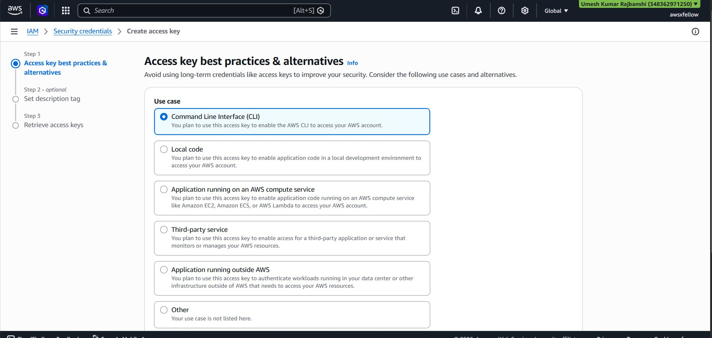
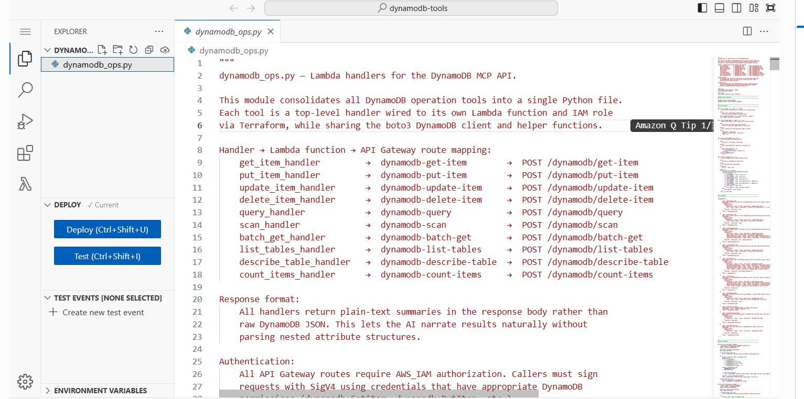
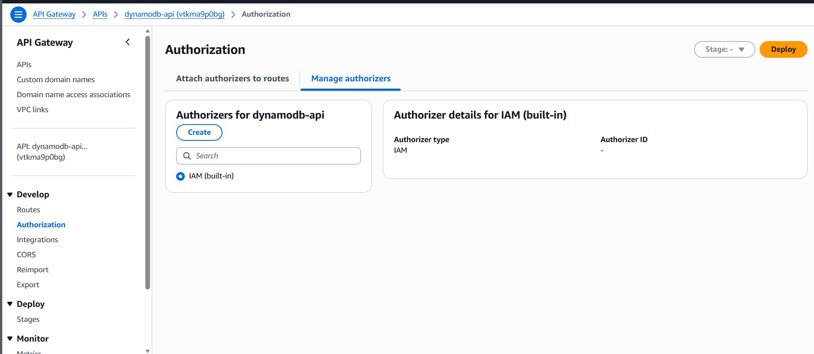

# Deployment Guide

This document walks through setting up and deploying the project from scratch on Ubuntu Linux.

---

## Prerequisites

- AWS Free Tier account
- Ubuntu Linux (VM or native)
- Windows PC (optional, for Kiro IDE)

---

## Required Tools

```bash
aws --version        # aws-cli 2.x
terraform -v         # 1.9.0+
jq --version         # 1.6+
envsubst --version   # any
git --version        # any
curl --version       # any
```

Install missing tools on Ubuntu:

```bash
sudo apt-get install curl jq gettext -y

# AWS CLI
curl "https://awscli.amazonaws.com/awscli-exe-linux-x86_64.zip" -o "awscliv2.zip"
unzip awscliv2.zip
sudo ./aws/install

# Terraform
wget -O- https://apt.releases.hashicorp.com/gpg | sudo gpg --dearmor -o /usr/share/keyrings/hashicorp-archive-keyring.gpg
echo "deb [signed-by=/usr/share/keyrings/hashicorp-archive-keyring.gpg] https://apt.releases.hashicorp.com $(lsb_release -cs) main" | sudo tee /etc/apt/sources.list.d/hashicorp.list
sudo apt update && sudo apt install terraform -y
```

---

## Step 1: Clone and Prepare

```bash
git clone https://github.com/jenishkhadka/aws-mcp-dynamo-backend.git
cd aws-mcp-dynamo-backend
chmod +x apply.sh destroy.sh check_env.sh validate.sh
```

---

## Step 2: Configure AWS Credentials

Get your access keys from the AWS Console:
1. Go to console.aws.amazon.com
2. Top right → your account name → Security credentials
3. Access keys → Create access key → select CLI → Create
4. Copy the Access Key ID and Secret Access Key



Then run:

```bash
aws configure
```

```
AWS Access Key ID: YOUR_ACCESS_KEY_ID
AWS Secret Access Key: YOUR_SECRET_ACCESS_KEY
Default region name: us-east-1
Default output format: json
```

Verify it worked:

```bash
aws sts get-caller-identity
```

You should see your account ID and ARN in the output.

---

## Step 3: Check Environment

```bash
./check_env.sh
```

All items should show a checkmark before proceeding.

---

## Step 4: Deploy

```bash
./apply.sh
```

Type `yes` when Terraform prompts. Takes about 2-5 minutes.

This creates the following AWS resources:

- 1 DynamoDB table (Users)
- 11 Lambda functions
- 1 API Gateway with 10 routes
- IAM user, roles, and least-privilege policies
- Secrets Manager secret with proxy credentials

**Lambda functions after deploy:**


**Lambda handler code — all 11 functions in one Python file:**



**API Gateway routes connected to Lambda:**


**API Gateway IAM authorization:**



**DynamoDB Users table active:**


---

## Step 5: Get Your Credentials

After deploy, retrieve your MCP credentials from Secrets Manager:

```bash
aws secretsmanager get-secret-value --secret-id dynamodb-mcp-proxy --region us-east-1
```


Note down:
- `access_key_id`
- `secret_access_key`
- `api_endpoint`
- `region`

---

## Step 6: Create MCP Config

```bash
cat > ~/aws-mcp-dynamo-backend/02-proxy/mcp_config.json << 'EOF'
{
  "mcpServers": {
    "dynamodb": {
      "command": "bash",
      "args": ["/home/YOUR_USERNAME/aws-mcp-dynamo-backend/02-proxy/proxy.sh"],
      "env": {
        "MCP_ACCESS_KEY_ID": "YOUR_ACCESS_KEY_ID",
        "MCP_SECRET_ACCESS_KEY": "YOUR_SECRET_ACCESS_KEY",
        "MCP_API_ENDPOINT": "https://YOUR_API_ID.execute-api.us-east-1.amazonaws.com/",
        "MCP_REGION": "us-east-1"
      }
    }
  }
}
EOF
```

Replace `YOUR_USERNAME`, `YOUR_ACCESS_KEY_ID`, `YOUR_SECRET_ACCESS_KEY`, and `YOUR_API_ID` with your actual values.

---

## Step 7: Test the Proxy

```bash
MCP_ACCESS_KEY_ID="YOUR_ACCESS_KEY_ID" \
MCP_SECRET_ACCESS_KEY="YOUR_SECRET_ACCESS_KEY" \
MCP_API_ENDPOINT="https://YOUR_API_ID.execute-api.us-east-1.amazonaws.com/" \
MCP_REGION="us-east-1" \
bash 02-proxy/proxy.sh
```

Expected output:

```
NOTE: DynamoDB MCP proxy started.
NOTE: Endpoint: https://YOUR_API_ID.execute-api.us-east-1.amazonaws.com/  Region: us-east-1
NOTE: Discovering tools from .../tools ...
NOTE: Discovered 10 tool(s).
```

If this works, the proxy is ready to connect to Kiro.

---

## Step 8: Set Up Kiro IDE

Install on Ubuntu:

```bash
wget https://desktop-release.kiro.dev/latest/linux/kiro.deb -O kiro.deb
sudo dpkg -i kiro.deb
sudo apt-get install -f
kiro
```

Connect MCP in Kiro:

1. Open Kiro → click MCP in sidebar → Enable
2. Click Edit Config to open `mcp.json`
3. Paste the contents of your `mcp_config.json`
4. Save and restart Kiro
5. Confirm bottom left shows `dynamodb Connected (10 tools)`


---

## Step 9: Test with AI

In Kiro Vibe chat, try these commands:

```
List all DynamoDB tables
```

```
Add an item to the Users table with userId "user1" and name "Jenish Khadka"
```

**AI writing to DynamoDB using natural language:**


```
Scan all items in the Users table where age is greater than 25
```

**AI querying DynamoDB and returning matched results:**


**Real data in DynamoDB after AI writes:**


---

## Verify Deployment

```bash
./validate.sh
```

Or check resources directly:

```bash
aws lambda list-functions --region us-east-1
aws dynamodb list-tables --region us-east-1
aws apigatewayv2 get-apis --region us-east-1
```

---

## Cleanup

```bash
./destroy.sh
```

This permanently deletes all Terraform-managed AWS resources.

---

## Troubleshooting

| Error | Fix |
|-------|-----|
| Permission denied on .sh files | `chmod +x *.sh` |
| curl not found | `sudo apt-get install curl -y` |
| MCP_ACCESS_KEY_ID is required | Check env vars in mcp_config.json |
| Output not found in Terraform | Run `./apply.sh` again |
| Items: [] in API Gateway | Use `apigatewayv2` not `apigateway` in CLI |
| Kiro MCP connection closed | Test proxy manually first (Step 7) |

---

## VMware Ubuntu VM Settings (Optional)

If running Ubuntu in VMware on a Windows PC with 16GB RAM:

| Setting | Recommended Value |
|---------|-------------------|
| Memory | 8192 MB |
| Processors | 2 |
| Cores per processor | 4 |