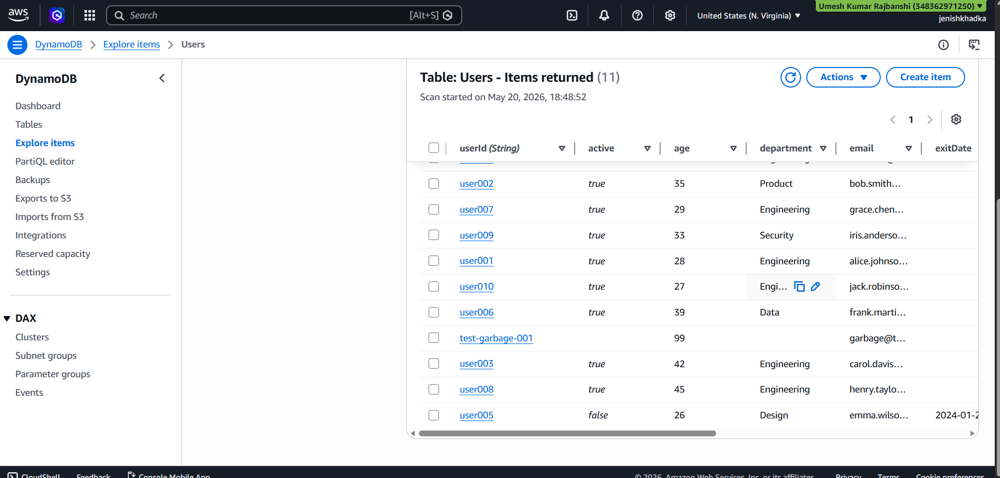

# Serverless DynamoDB API with MCP Integration

A serverless backend on AWS that lets an AI assistant interact with a real DynamoDB database using natural language. Built entirely with Infrastructure as Code using Terraform.

Built by Jenish Khadka — May 2026

---

## What This Does

You type a natural language command in your AI IDE (Kiro). The AI calls one of 10 DynamoDB tools exposed through an API Gateway backed by Lambda functions. The request gets signed with AWS SigV4 through a local proxy, hits the API, and returns a plain-text result the AI can read and narrate back to you.

In short: ask your AI to add a user to a database, and it actually does it.

---

## Demo


*Kiro IDE showing dynamodb Connected (10 tools)*


*AI calling dynamodb_put_item and writing a real item to AWS DynamoDB*


*AI scanning DynamoDB with a filter and returning matched results*


*Real data in the Users table after AI writes*

For full deployment screenshots and step-by-step setup, see [DEPLOYMENT.md](DEPLOYMENT.md).

---

## Architecture

```
Kiro IDE (AI assistant)
     | MCP Protocol (stdio)
     v
proxy.sh — signs requests with SigV4
     | HTTPS + AWS IAM auth
     v
API Gateway (HTTP API) — dynamodb-api
     | routes to individual Lambda functions
     v
AWS Lambda (Python 3.13) — 11 functions
     v
AWS DynamoDB
```

---

## Tech Stack

| Technology          | Purpose                    |
|---------------------|---------------------------|
| AWS Lambda          | Serverless compute         |
| AWS API Gateway     | Route management           |
| AWS DynamoDB        | NoSQL database             |
| AWS IAM + SigV4     | Auth and request signing   |
| AWS Secrets Manager | Credential storage         |
| Terraform           | Infrastructure as Code     |
| Python 3.13         | Lambda runtime             |
| Bash                | MCP proxy script           |
| Ubuntu 24.04        | Development environment    |

---

## Available Tools

| Tool                    | Operation                      |
|-------------------------|-------------------------------|
| dynamodb_get_item       | Get a single item by key       |
| dynamodb_put_item       | Create or replace an item      |
| dynamodb_update_item    | Update specific fields         |
| dynamodb_delete_item    | Delete an item                 |
| dynamodb_query          | Query by partition key         |
| dynamodb_scan           | Scan entire table with filters |
| dynamodb_batch_get      | Get multiple items at once     |
| dynamodb_list_tables    | List all DynamoDB tables       |
| dynamodb_describe_table | Get table schema and metadata  |
| dynamodb_count_items    | Count items in a table         |

---

## Quick Start

```bash
git clone https://github.com/jenishkhadka/aws-mcp-dynamo-backend.git
cd aws-mcp-dynamo-backend
chmod +x apply.sh destroy.sh check_env.sh validate.sh
aws configure
./apply.sh
```

For the full setup guide including AWS credential setup, Kiro IDE configuration, and troubleshooting, see [DEPLOYMENT.md](DEPLOYMENT.md).

---

## Try It

Once connected, you can ask the AI:

```
List all my DynamoDB tables
Add a user to the Users table with userId "user1" and name "Jenish Khadka"
Get the item from Users table where userId is "user1"
Scan all items in Users table where age is greater than 25
Count all items in the Users table
Delete the user with userId "user1" from the Users table
```

---

## Sample Table (Optional)

The repo includes `01-lambdas/sample-table.tf` which creates a Users table with 10 pre-populated records for testing. To skip it, delete or rename that file before deploying.

---

## AWS Cost

Runs almost entirely within AWS Free Tier. Secrets Manager costs around $0.40/month after the first 30 days. Everything else is free at this scale.

---

## Cleanup

```bash
./destroy.sh
```

This removes all Terraform-managed AWS resources permanently.

---

## What I Learned

- Provisioning AWS infrastructure with Terraform from scratch
- Serverless architecture with Lambda and API Gateway
- IAM least-privilege design and SigV4 request signing
- MCP protocol and connecting AI tools to external APIs
- Secure credential management with Secrets Manager
- Shell scripting and Linux for deployment automation

---

## Reference

- Full deployment guide with screenshots: [DEPLOYMENT.md](DEPLOYMENT.md)


---

## License

MIT