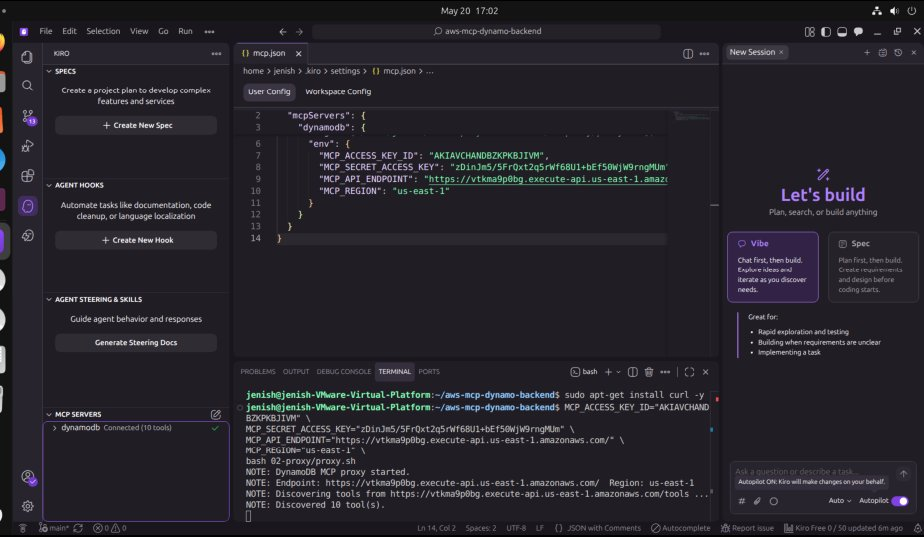
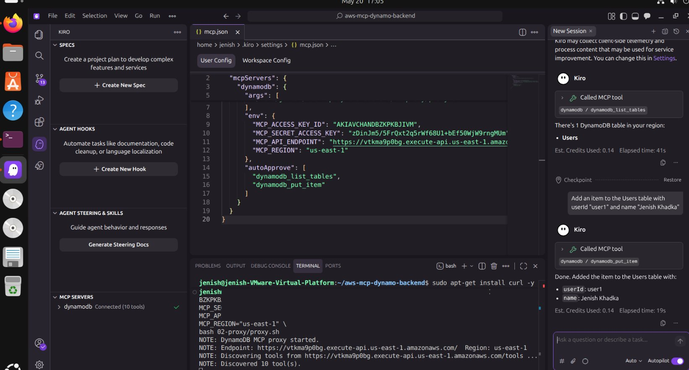
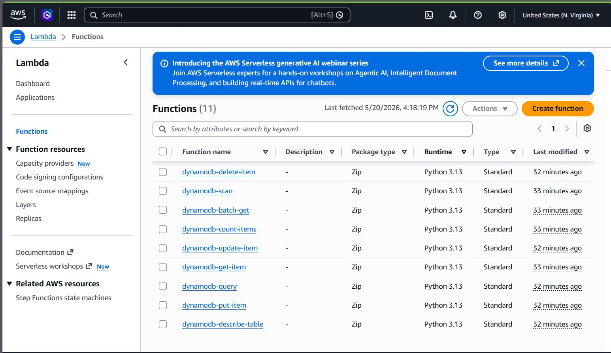
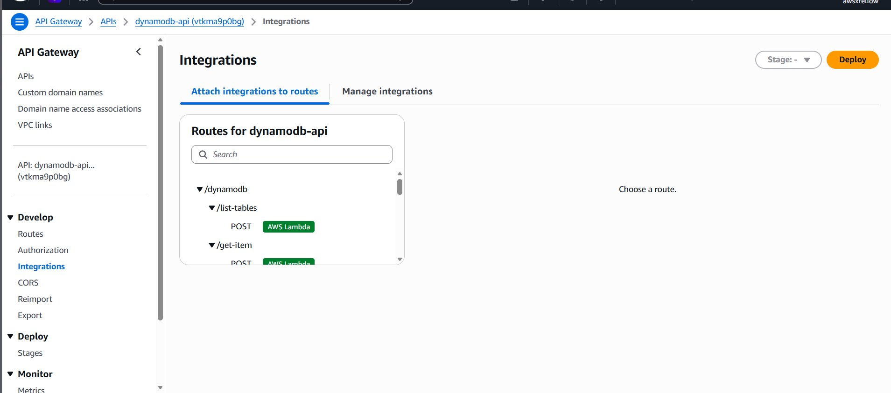
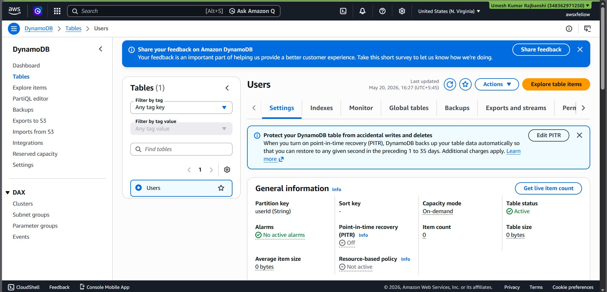
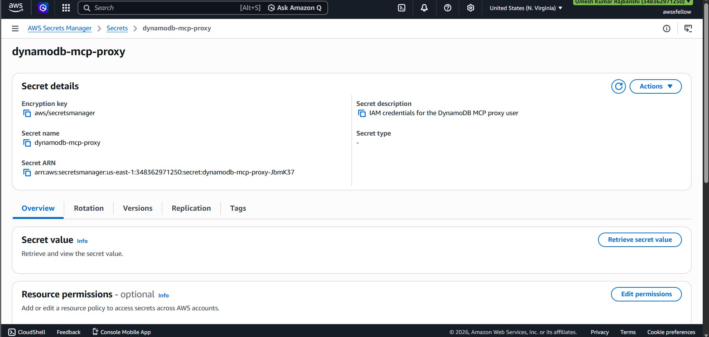
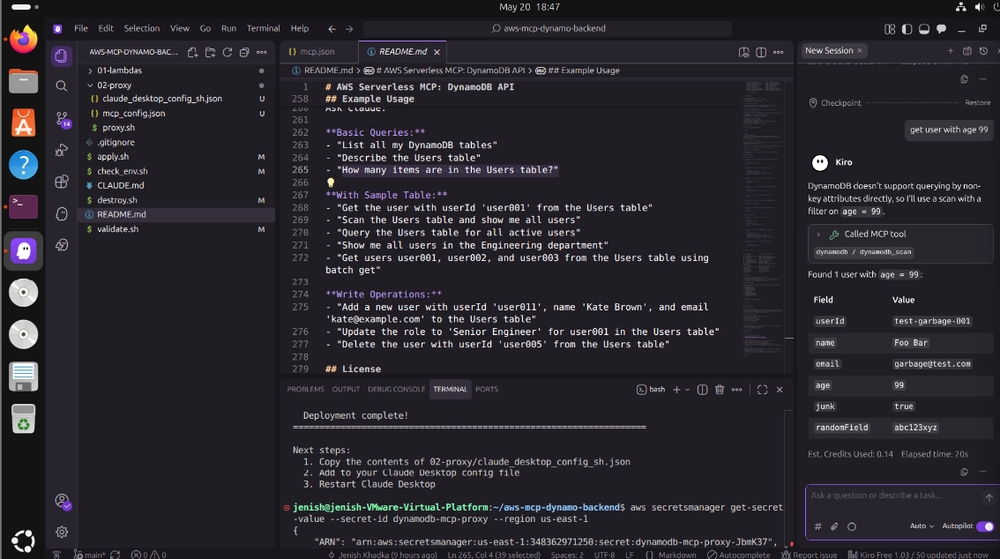

# 🚀 Serverless DynamoDB MCP Backend on AWS

> An AI-powered serverless backend that lets an AI assistant (Kiro IDE) read and write to a real AWS DynamoDB database using natural language — built entirely with Infrastructure as Code.

**Built by:** Jenish Khadka  
**Date:** May 20, 2026  
**Stack:** AWS Lambda · API Gateway · DynamoDB · IAM SigV4 · Secrets Manager · Terraform · Kiro IDE

---

## 📸 Demo

> AI writing to a real AWS DynamoDB database using natural language in Kiro IDE


*Kiro IDE showing dynamodb Connected (10 tools)*


*AI calling dynamodb_put_item MCP tool and writing to real AWS database*

---

## 🏗️ Architecture

```
┌─────────────────────────────────────────────────────────┐
│                     Kiro IDE (AI)                        │
│              "Add user Jenish to Users table"            │
└─────────────────────┬───────────────────────────────────┘
                      │ MCP Protocol (stdio)
                      ▼
┌─────────────────────────────────────────────────────────┐
│                   proxy.sh                               │
│           SigV4 Request Signing (bash)                   │
└─────────────────────┬───────────────────────────────────┘
                      │ HTTPS + AWS SigV4
                      ▼
┌─────────────────────────────────────────────────────────┐
│              AWS API Gateway (HTTP API)                  │
│         dynamodb-api · us-east-1                        │
│                                                         │
│  POST /dynamodb/get-item                                │
│  POST /dynamodb/put-item                                │
│  POST /dynamodb/update-item                             │
│  POST /dynamodb/delete-item                             │
│  POST /dynamodb/query                                   │
│  POST /dynamodb/scan                                    │
│  POST /dynamodb/batch-get                               │
│  POST /dynamodb/list-tables                             │
│  POST /dynamodb/describe-table                          │
│  POST /dynamodb/count-items                             │
└─────────────────────┬───────────────────────────────────┘
                      │ IAM Authorized
                      ▼
┌─────────────────────────────────────────────────────────┐
│           AWS Lambda Functions (Python 3.13)             │
│                    11 functions                          │
└─────────────────────┬───────────────────────────────────┘
                      │
                      ▼
┌─────────────────────────────────────────────────────────┐
│              AWS DynamoDB (NoSQL)                        │
│                  Users Table                             │
│         Partition Key: userId (String)                   │
└─────────────────────────────────────────────────────────┘
```

---

## 🛠️ Tech Stack

| Technology | Version | Purpose |
|------------|---------|---------|
| AWS Lambda | - | Serverless compute |
| AWS API Gateway | HTTP API | Route management |
| AWS DynamoDB | - | NoSQL database |
| AWS IAM SigV4 | - | Request signing & auth |
| AWS Secrets Manager | - | Credential storage |
| Terraform | 1.9.0 | Infrastructure as Code |
| Kiro IDE | Latest | AI MCP client |
| Python | 3.13 | Lambda runtime |
| Bash | 4+ | MCP proxy script |
| Ubuntu | 24.04 | Development environment |

---

## 📁 Project Structure

```
aws-mcp-dynamo-backend/
├── apply.sh                    # 🚀 Deploy everything to AWS
├── destroy.sh                  # 🗑️  Delete all AWS resources
├── check_env.sh                # ✅ Verify tools and credentials
├── validate.sh                 # 🧪 Test Lambda functions
├── CLAUDE.md                   # Claude AI instructions
├── README.md                   # This file
│
├── 01-lambdas/                 # Terraform + Lambda code
│   ├── code/
│   │   └── dynamodb_ops.py     # All Lambda handlers (Python)
│   ├── main.tf                 # AWS provider configuration
│   ├── api.tf                  # API Gateway setup
│   ├── iam-proxy-user.tf       # IAM user, roles, policies
│   ├── sample-table.tf         # DynamoDB Users table
│   ├── lambda-tools.tf         # Tools discovery endpoint
│   ├── lambda-get-item.tf      # GET item Lambda
│   ├── lambda-put-item.tf      # PUT item Lambda
│   ├── lambda-update-item.tf   # UPDATE item Lambda
│   ├── lambda-delete-item.tf   # DELETE item Lambda
│   ├── lambda-query.tf         # QUERY Lambda
│   ├── lambda-scan.tf          # SCAN Lambda
│   ├── lambda-batch-get.tf     # BATCH GET Lambda
│   ├── lambda-list-tables.tf   # LIST TABLES Lambda
│   ├── lambda-describe-table.tf# DESCRIBE TABLE Lambda
│   └── lambda-count-items.tf   # COUNT ITEMS Lambda
│
└── 02-proxy/
    ├── proxy.sh                # MCP stdio proxy (SigV4 signing)
    └── mcp_config.json         # MCP server config for Kiro IDE
```

---

## ⚙️ Prerequisites

### Required Tools

```bash
aws --version       # AWS CLI 2.x
terraform -v        # Terraform 1.9+
jq --version        # jq 1.6+
curl --version      # curl any
git --version       # git any
envsubst --version  # gettext
```

### Install on Ubuntu

```bash
# curl
sudo apt-get install curl -y

# jq
sudo apt install jq -y

# gettext (envsubst)
sudo apt install gettext -y

# AWS CLI
curl "https://awscli.amazonaws.com/awscli-exe-linux-x86_64.zip" -o "awscliv2.zip"
unzip awscliv2.zip
sudo ./aws/install

# Terraform
wget -O- https://apt.releases.hashicorp.com/gpg | sudo gpg --dearmor -o /usr/share/keyrings/hashicorp-archive-keyring.gpg
echo "deb [signed-by=/usr/share/keyrings/hashicorp-archive-keyring.gpg] https://apt.releases.hashicorp.com $(lsb_release -cs) main" | sudo tee /etc/apt/sources.list.d/hashicorp.list
sudo apt update && sudo apt install terraform -y
```

---

## 🚀 Setup & Deployment

### Step 1: Clone the Repository

```bash
git clone https://github.com/YOUR_USERNAME/aws-mcp-dynamo-backend.git
cd aws-mcp-dynamo-backend
```

### Step 2: Make Scripts Executable

```bash
chmod +x validate.sh check_env.sh apply.sh destroy.sh
```

### Step 3: Configure AWS Credentials

Get your Access Keys from:
`AWS Console → IAM → Users → Security Credentials → Create Access Key → CLI`

```bash
aws configure
```

```
AWS Access Key ID: YOUR_ACCESS_KEY_ID
AWS Secret Access Key: YOUR_SECRET_ACCESS_KEY
Default region name: us-east-1
Default output format: json
```

Verify:
```bash
aws sts get-caller-identity
```

Expected:
```json
{
    "UserId": "AIDAXXXXXXXXXXXXXXXXX",
    "Account": "YOUR_ACCOUNT_ID",
    "Arn": "arn:aws:iam::YOUR_ACCOUNT_ID:user/YOUR_USERNAME"
}
```

### Step 4: Check Environment

```bash
./check_env.sh
```


*All tools verified and AWS credentials confirmed*

Expected output:
```
===================================================================
  DynamoDB MCP — Environment Check
===================================================================
  ✓ aws
  ✓ terraform
  ✓ jq
  ✓ envsubst
  ✓ AWS Account: YOUR_ACCOUNT_ID
  ✓ Identity: arn:aws:iam::YOUR_ACCOUNT_ID:user/YOUR_USERNAME
===================================================================
  Environment check passed!
===================================================================
```

### Step 5: Deploy Everything

```bash
./apply.sh
```

Type `yes` when prompted. Takes **2-5 minutes**.


*Terraform successfully deployed all AWS resources*

### Step 6: Get Your Generated Credentials

```bash
# Find your API endpoint
aws apigatewayv2 get-apis --region us-east-1

# Get your MCP secret credentials
aws secretsmanager get-secret-value --secret-id dynamodb-mcp-proxy --region us-east-1
```

### Step 7: Create MCP Config

```bash
cat > ~/aws-mcp-dynamo-backend/02-proxy/mcp_config.json << 'EOF'
{
  "mcpServers": {
    "dynamodb": {
      "command": "bash",
      "args": ["/home/YOUR_USERNAME/aws-mcp-dynamo-backend/02-proxy/proxy.sh"],
      "env": {
        "MCP_ACCESS_KEY_ID": "YOUR_MCP_ACCESS_KEY_ID",
        "MCP_SECRET_ACCESS_KEY": "YOUR_MCP_SECRET_ACCESS_KEY",
        "MCP_API_ENDPOINT": "https://YOUR_API_ID.execute-api.us-east-1.amazonaws.com/",
        "MCP_REGION": "us-east-1"
      }
    }
  }
}
EOF
```

### Step 8: Test Proxy Manually

```bash
MCP_ACCESS_KEY_ID="YOUR_MCP_ACCESS_KEY_ID" \
MCP_SECRET_ACCESS_KEY="YOUR_MCP_SECRET_ACCESS_KEY" \
MCP_API_ENDPOINT="https://YOUR_API_ID.execute-api.us-east-1.amazonaws.com/" \
MCP_REGION="us-east-1" \
bash 02-proxy/proxy.sh
```

Expected:
```
NOTE: DynamoDB MCP proxy started.
NOTE: Endpoint: https://YOUR_API_ID.execute-api.us-east-1.amazonaws.com/  Region: us-east-1
NOTE: Discovering tools from https://YOUR_API_ID.execute-api.us-east-1.amazonaws.com/tools ...
NOTE: Discovered 10 tool(s).
```

---

## 🔧 Kiro IDE Setup

### Install Kiro on Ubuntu

```bash
wget https://desktop-release.kiro.dev/latest/linux/kiro.deb -O kiro.deb
sudo dpkg -i kiro.deb
sudo apt-get install -f
kiro
```

### Configure MCP in Kiro

1. Open Kiro IDE
2. Click **MCP** in sidebar → **Enable**
3. Click **Edit Config** → opens `mcp.json`
4. Paste your `mcp_config.json` contents
5. Save → Restart Kiro
6. Check bottom left: `dynamodb Connected (10 tools)` ✅


*MCP configuration in Kiro IDE mcp.json*

---

## ✅ What Gets Created on AWS


*11 Lambda functions deployed in AWS Console*


*API Gateway with all DynamoDB routes*


*Users table created in DynamoDB*


*Credentials stored securely in AWS Secrets Manager*

| Resource | Name | Count |
|----------|------|-------|
| DynamoDB Tables | `Users` | 1 |
| Lambda Functions | `dynamodb-*` | 11 |
| API Gateway | `dynamodb-api` | 1 |
| API Routes | `/dynamodb/*` | 10 |
| IAM Users | `dynamodb-mcp-proxy` | 1 |
| Secrets | `dynamodb-mcp-proxy` | 1 |

---

## 🤖 MCP Tools Available

Once connected, the AI has access to these 10 tools:

| Tool | Route | Description |
|------|-------|-------------|
| `dynamodb_get_item` | POST /dynamodb/get-item | Get a single item by key |
| `dynamodb_put_item` | POST /dynamodb/put-item | Create or replace an item |
| `dynamodb_update_item` | POST /dynamodb/update-item | Update specific fields |
| `dynamodb_delete_item` | POST /dynamodb/delete-item | Delete an item |
| `dynamodb_query` | POST /dynamodb/query | Query by partition key |
| `dynamodb_scan` | POST /dynamodb/scan | Scan entire table |
| `dynamodb_batch_get` | POST /dynamodb/batch-get | Get multiple items |
| `dynamodb_list_tables` | POST /dynamodb/list-tables | List all tables |
| `dynamodb_describe_table` | POST /dynamodb/describe-table | Get table details |
| `dynamodb_count_items` | POST /dynamodb/count-items | Count items in table |

---

## 🎮 Demo Commands

In Kiro Vibe chat, try these natural language commands:

```
List all DynamoDB tables in my AWS account
```

```
Add an item to the Users table with userId "user1" and name "Jenish Khadka"
```

```
Get the item from Users table where userId is "user1"
```

```
Scan all items in the Users table
```

```
Count all items in the Users table
```

```
Delete the item from Users table where userId is "user1"
```


*AI successfully writing to real AWS DynamoDB database*

---

## 🧹 Cleanup

To delete all AWS resources:

```bash
./destroy.sh
```

⚠️ This permanently deletes everything Terraform created.

---

## 🐛 Troubleshooting

| Error | Cause | Fix |
|-------|-------|-----|
| `Permission denied` on .sh | No execute bit | `chmod +x *.sh` |
| `curl: command not found` | curl not installed | `sudo apt-get install curl -y` |
| `MCP_ACCESS_KEY_ID is required` | Env vars missing | Check mcp.json config |
| `Output not found` in terraform | State mismatch | Run `./apply.sh` again |
| `Items: []` in API Gateway | Wrong API type | Use `apigatewayv2` not `apigateway` |
| Kiro MCP connection closed | proxy.sh failing | Test proxy manually first |
| `Operation inhibited` on shutdown | Active sessions | `sudo systemctl poweroff -i` |

---

## 💰 AWS Cost

This project runs **almost entirely within AWS Free Tier**:

| Service | Free Tier | Cost |
|---------|-----------|------|
| Lambda | 1M requests/month | ✅ Free |
| API Gateway | 1M requests/month | ✅ Free |
| DynamoDB | 25GB + 25 RCU/WCU | ✅ Free |
| Secrets Manager | First 30 days free | ⚠️ $0.40/month after |

**Total estimated cost: ~$0.40/month**

---

## 📚 What I Learned

- **Terraform** — Infrastructure as Code, managing AWS resources with `.tf` files
- **AWS Lambda** — Serverless functions, Python handlers, IAM roles
- **API Gateway** — HTTP APIs, route management, IAM authorization
- **SigV4** — AWS request signing protocol for secure API calls
- **MCP Protocol** — Model Context Protocol, connecting AI to external tools
- **Linux** — Terminal commands, shell scripting, file permissions
- **DynamoDB** — NoSQL database design, partition keys, CRUD operations

---

## 🙏 Credits

- Original project concept from YouTube tutorial
- Built on AWS Free Tier
- MCP Protocol by Anthropic

---

## 📄 License

MIT License — feel free to use and modify.
